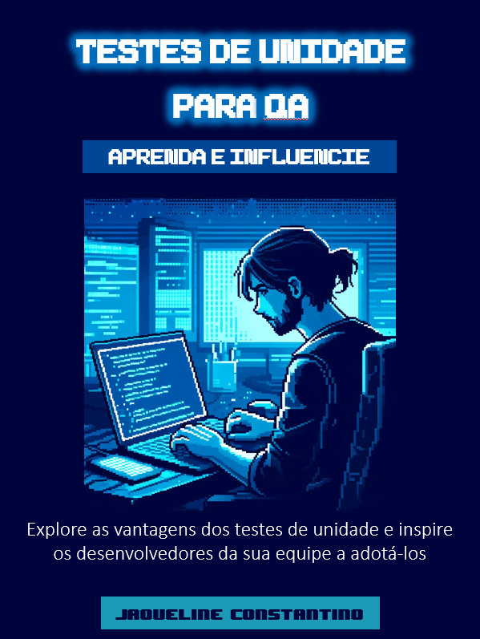

    

-------

# Projeto EBOOK Gerado por I.A.s

 > ℹ️ **NOTE:** Este é o repositório criado com fins didáticos para a atividade da disciplina de “Introdução a Engenharia de Prompts com ChatGPT” do Bootcamp Santander 2024 – Fundamentos de IA para Devs na plataforma da [DIO](https://dio.me)

Projeto com o objetivo de gerar um ebook digital com as facilidades das ferramentas de IA. Todos os prompts
seguem abaixo.

<a href="https://github.com/cnjaqueline/ebook-created-using-chatGPT/blob/main/output/Ebook_IA_Unit_Testing.pdf" title="View PDF now"> 📕Clique aqui para ler</a>

## 💻 Tecnologias utilizadas no projeto

- [ChatGPT](https://chat.openai.com/) 
- [PowerPoint](https://www.microsoft.com/en/microsoft-365/powerpoint)

## 🧠 Prompts

ChatGPT：

|   Ação   | prompt                                                                                                                                                                                                                                                                         |
| :------: | ------------------------------------------------------------------------------------------------------------------------------------------------------------------------------------------------------------------------------------------------------------------------------ |
|  título  | Crie um titulo de um ebook sobre testes de unidade para QA, o ebook é do nicho de programação, o titulo deve ser curto e convincente, me liste 5 variações de títulos.                                                        |
| conteúdo | Faça um texto para ebook, com foco em testes de unidade em desenvolvimento de software, listando as principais vantagens e citando exemplos em código {REGRAS} > Explique sempre de uma maneira simples > Deixe o texto enxuto > Sempre traga exemplos de código em contextos reais > Sempre deixe um título sugestivo por tópico |

ChatGPT Image Genarator：

|  Ação  | prompt                                                                                 |
| :----: | -------------------------------------------------------------------------------------- |
| título | A computer programmer typing something on a laptop, with a blue illuminated background, pixel art style |

## ✨ Features

- Conteúdo gerado via ChatGPT
- Imagens geradas via ChatGPT Image Genarator

## 📚 Materiais

- Imagens utilizadas em `assets`
- ebook gerado durante as aulas em `output`

## 🛠️ Instruções de execução

Utilize os prompts acima nas ferramentas sugeridas para gerar o material base e utilize uma ferramenta de edição de documentos como power point, libreoffice , indesign para diagramação.

## 👨‍💻 Expert

    
    
&nbsp&nbsp&nbspFelipe Aguiar 
    &nbsp&nbsp&nbsp
    <a href="https://github.com/cnjaqueline">
    GitHub</a>&nbsp;|&nbsp;
    <a href="www.linkedin.com/in/
jaquelineconstantino">LinkedIn</a>
&nbsp;|&nbsp;

  

---

⌨️ com 💜 por [Jaqueline Constantino](https://github.com/cnjaqueline)